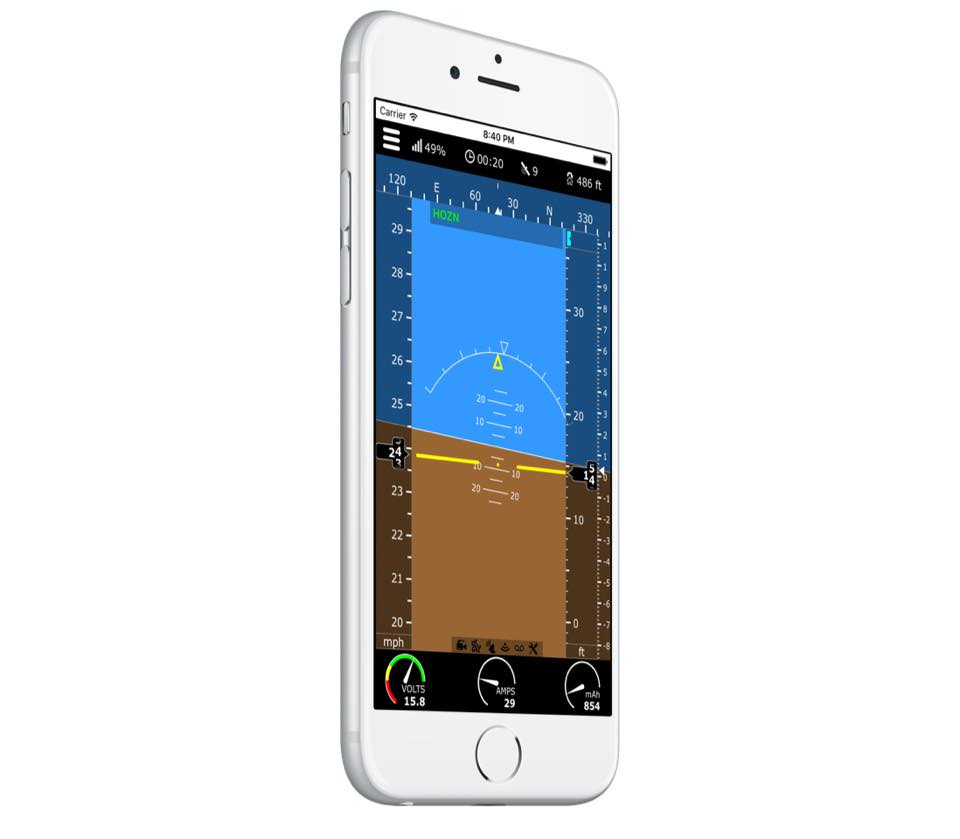

# Mobile Flight

Mobile Flight is an iOS app to configure and monitor aircrafts running Cleanflight and compatible forks such as INAV and Betaflight.
Mobile Flight runs on iPhone and iPad and connects to the aircraft using Wi-Fi or Bluetooth 4.0 (Bluetooth Low Energy.) 

Mobile Flight can be installed from the [AppStore](https://itunes.apple.com/us/app/mobile-flight-for-cleanflight-betaflight-inav/id1079191425?mt=8)

